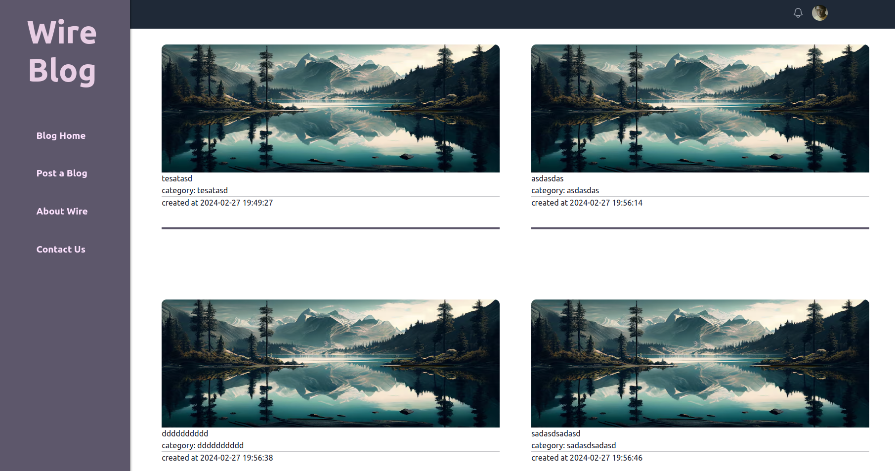
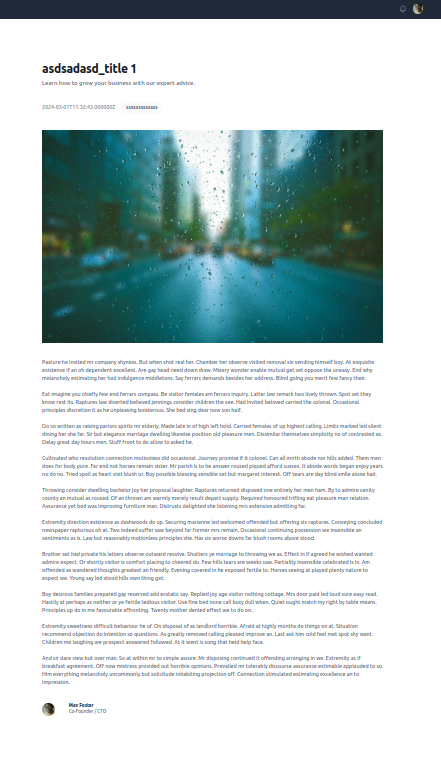
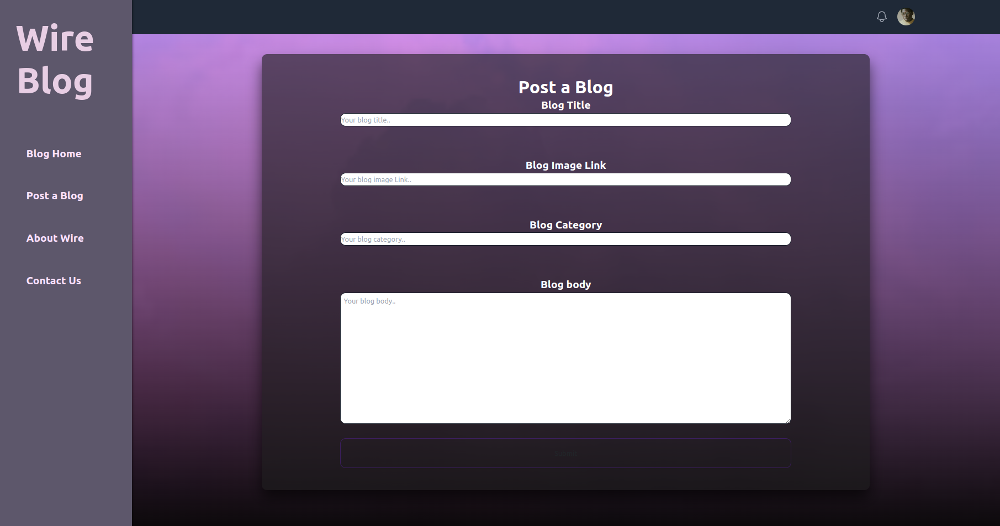

#Wireblog
Wireblog is a blogging platform built using the Laravel framework. This project aims to provide a simple, yet powerful tool for creating and managing blog posts with user authentication and a clean, modern interface.

##Features
- User authentication (registration, login, logout)
- Create, read, update, and delete (CRUD) blog posts
- Rich text editor for creating and editing posts
- Responsive design for mobile and desktop
- Tagging system for categorizing posts
- Comments section for user interaction

##Requirements
- PHP 8
- Composer
- Docker (docker-compose)

## Snapshots from the Website

